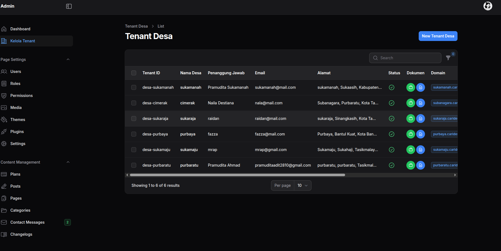

# 🏘️ Cari Desa

Platform pariwisata desa berbasis multi-tenant yang memungkinan setiap desa memiliki website sendiri untuk mempromosikan wisata, produk lokal, dan budaya desa.

Berikut adalah dokumentasi dari development Cari desa

## Requirements

- PHP 8.2+
- Composer
- Node.js & NPM
- PostgreSQL atau MySQL (Yang penting SQL dan di support oleh ORM Laravel)
- Redis (optional but recommended for caching and queues)
- Nginx atau Apache (untuk server web)

## Libraries Documentation

- [Laravel 11](https://laravel.com/docs/11.x)
- [Laravel Tenancy](https://tenancyforlaravel.com/)
- [Dev Dojo Wave](https://devdojo.com/wave)
- [Filament Admin](https://filamentphp.com/docs/2.x/admin/installation)
- [Tailwind CSS](https://tailwindcss.com/docs/installation)

## Installation

### 1. Clone the repository
Langsung clone dari main jangan gunakan branch lain

```bash
git clone https://github.com/yourusername/cari_desa.git
cd cari_desa
```

### 2. Install dependencies
```bash
composer install
npm install
```

### 3. Environment setup
```bash
cp .env.example .env
php artisan key:generate
```

### 4. Configure your `.env` file
```env
DB_CONNECTION=mysql
DB_HOST=127.0.0.1
DB_PORT=3306
DB_DATABASE=cari_desa
DB_USERNAME=your_username
DB_PASSWORD=your_password

CENTRAL_DOMAINS=localhost
SESSION_DOMAIN=.localhost
```

### 5. Run migrations and seeders
```bash
php artisan migrate
php artisan db:seed
```

### 6. Create storage link
```bash
php artisan storage:link
```

### 7. Build assets
```bash
npm run dev
```

### 8. Serve the application
```bash
php artisan serve
```

Visit `http://localhost:8000` in your browser.

## Default Login

**Super Admin:**
- URL: `http://localhost:8000/admin`
- Email: `admin@admin.com`
- Password: `password`

## System Architecture

Perlu diingat sistem dari Cari Desa terdapat 2 sistem utama yaitu sistem **Central** dan sistem **Tenant**:

- **Central System**: Digunakan untuk mengelola tenant dan konfigurasi global
- **Tenant System**: Digunakan untuk mengelola website desa masing-masing

## Tenant Management

### 1. Create a New Tenant
Untuk membuat tenant baru:

1. **Registrasi Desa** - Buat desa baru melalui halaman registrasi:
   ```
   http://your-app-url/daftar-desa
   ```

2. **Approval Tenant** - Masuk ke admin central dan approve tenant:
   - Login ke `http://your-app-url/admin`
   - Masuk ke menu **Tenants**
   - Pilih tenant yang akan di-approve
   - Klik tombol **Approve**
   
   Setelah di-approve, sistem akan secara otomatis:
   - ✅ Menjalankan migrations untuk tenant
   - ✅ Melakukan seeding data awal
   - ✅ Membuat subdomain untuk tenant
   - ✅ Setup database tenant



### 2. Access Tenant Dashboard
Setelah tenant dibuat dan di-approve, akses dashboard tenant melalui:
```
http://{subdomain}.your-app-url/admin
```

**Contoh:**
```
http://desa-sukamaju.localhost:8000/admin
```

### 3. Tenant Features
- ✅ **Multi-tenant architecture** - Isolasi data per desa
- ✅ **Auto-generated subdomains** - Subdomain otomatis untuk setiap desa
- ✅ **Product management** - Kelola produk lokal desa
- ✅ **Destination management** - Kelola destinasi wisata
- ✅ **Homestay management** - Sistem booking homestay
- ✅ **Local product catalog** - Katalog produk UMKM
- ✅ **Travel guides** - Panduan wisata lokal
- ✅ **Multiple theme options** - Pilihan tema website
- ✅ **SEO optimized** - Struktur SEO-friendly

## Tenant Artisan Commands

### 📋 **Basic Commands**
```bash
# Melihat daftar semua tenant yang terdaftar
php artisan tenants:list

# Menjalankan command untuk tenant tertentu
php artisan tenants:run <command> --tenants=<tenant_id>
```

### 🗄️ **Database Management**
```bash
# Migrasi database untuk semua tenant
php artisan tenants:migrate

# Migrasi database untuk tenant tertentu
php artisan tenants:migrate --tenants=1,2,3

# Fresh migration (drop & recreate tables)
php artisan tenants:migrate-fresh

# Rollback migrasi
php artisan tenants:rollback

# Rollback dengan step tertentu
php artisan tenants:rollback --step=5
```

### 🌱 **Seeding Commands**
```bash
# Seed data untuk semua tenant
php artisan tenants:seed

# Seed data untuk tenant tertentu
php artisan tenants:seed --tenants=1,2,3

# Seed dengan seeder class tertentu
php artisan tenants:seed --class=TenantSeeder
```

### 🔧 **Utility Commands**
```bash
# Menjalankan command Laravel apapun untuk tenant
php artisan tenants:run "migrate:status" --tenants=1
php artisan tenants:run "cache:clear" --tenants=1,2,3
php artisan tenants:run "config:cache" --tenants=all

# Menjalankan command dengan output verbose
php artisan tenants:run "route:list" --tenants=1 -v
```

### 📝 **Command Examples**
```bash
# Clear cache untuk tenant tertentu
php artisan tenants:run "cache:clear" --tenants=1

# Generate report untuk semua tenant
php artisan tenants:run "app:generate-report" --tenants=all

# Backup database tenant
php artisan tenants:run "backup:run" --tenants=1,2

# Optimize tenant performance
php artisan tenants:run "optimize" --tenants=all
```

### ⚙️ **Advanced Usage**
```bash
# Filter tenant berdasarkan domain
php artisan tenants:migrate --domains=desa1.localhost,desa2.localhost

# Exclude tenant tertentu
php artisan tenants:migrate --except=3,4,5

# Dry run (simulasi tanpa eksekusi)
php artisan tenants:migrate --pretend

# Force migrate in production
php artisan tenants:migrate --force
```
